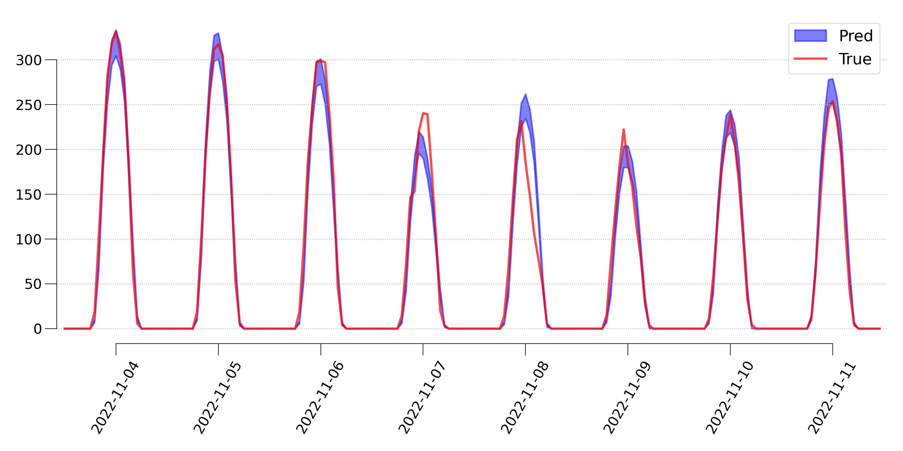

# 2022 POSTECH OIBC CHALLENGE 태양광 발전량 예측 경진대회

[2022 POSTECH OIBC CHALLENGE 태양광 발전량 예측 경진대회](https://o.solarkim.com/cmpt2022)에서 대상을 받은 Sun Capturer팀의 솔루션 및 발표 자료입니다.

## Sun capturer팀
"태양과 상금을 획득하는 사람"의 의미
- 조성하 (POSTECH 수학과)
- 이은미 (POSTECH 환경공학부)
- 이동진 (POSTECH 인공지능대학원)

 

## 대회 소개
- 대회 목표: 타 지역 태양광 발전소들의 발전량 데이터를 활용하여 신규 설치된 광명시 태양광 발전소의 다음 날 24시간 동안의 매시간 발전량 구간 예측 등록
- 대회 기간
    - 2022년 10월 24일 ~ 2022년 11월 12일: 사전 대회 기간 (태양광 발전량 예측 모델 구축 기간)
    - 2022년 11월 14일 ~ 2022년 11월 18일: 경진 대회 기간 (실제 태양광 발전량 예측)
    - 2022년 12월 01일: 발표 평가
    - 2022년 12월 02일: 결과 발표

 

## 팀의 해결 책
- WaveNet 기반 확률 모델 (태양광 발전량의 평균과 표준편차 출력)
- [발표 자료](./2022-12-01_OIBCcompetition_Sun_capturer.pdf) 참고

 

## 디렉토리 구성
이 레포지토리의 구성은 다음과 같습니다. 
~~~
root
│
├── README.md                                    # 디렉토리 안내 파일
│
├── 2022-12-01_OIBCCompetition_Sun_capturer.pdf  # 발표 자료
│
├── data/                                        # 데이터 폴더 (첨부파일에서는 생략)
│
├── ckpt/                                        # 모델 체크포인트 폴더
│
├── notebooks/                                   # ipynb 파일 폴더
│   ├── (1)_Collecting_data.ipynb                # API를 사용하여 forecasts1 및 gens 데이터 수집
│   ├── (2)_Preprocessing_forecasts1.ipynb       # forecasts1.csv, gens.csv 전처리 및 병합
│   ├── (3)_Train.ipynb                          # 모델 훈련
│   ├── (4)_Inference_ensemble_models.ipynb      # 단일 모델 입찰
│   ├── (4)_Inference_single_model.ipynb         # 앙상블 입찰
│   └── 외 기타 ipynb 파일
│
└── suncapturer/                                 # 사용자 정의 모듈 일체
    ├── __init__.py                              # 모듈화
    ├── datasets.py                              # torch.utils.Dataset 정의
    ├── losses.py                                # 손실함수 및 평가지표 정의
    ├── networks.py                              # WaveNet 및 CausalWaveNet 정의
    ├── solver.py                                # 모델 훈련 클래스
    ├── utils.py                                 # 기타 유틸리티 함수 일체
    └── config/                                  # 모델 훈련 하이퍼파라미터 폴더
         └── __init__.py                         # 모듈화
~~~

## 코드 실행
코드는 `notebooks/` 폴더에 있는 ipynb 파일들을 번호 순서대로 (1)번부터 (4)까지 실행하시면 됩니다. (1)번과 (2)번은 데이터 전처리 코드이기 때문에 한번만 실행하면 그 이후로는 실행할 필요가 없습니다. (3)번에서 여러가지 하이퍼파라미터를 설정하여 모델을 훈련시키고 그 결과를 WanDB를 통해 비교할 수 있습니다. 파일명이 번호가 아닌 날짜로 시작하는 ipynb 파일들은 주로 분석용 및 시각화 파일이며, 코드가 정리되어 있지 않습니다.

 

`notebooks/`에 있는 파일 실행시 `suncapturer`에서 임포트하는 모듈들은 `suncapturer/` 폴더에서 확인하실 수 있습니다. `setuptools` 모듈의 `setup`을 사용해서 패키징 하지 않았기 때문에 `sys.path.append`를 통해 `suncapturer/` 폴더의 위치를 추가해줘야 합니다.

 

## 문의
코드 사용에 어려움이나 질문이 있으실 경우 dongjinlee@postech.ac.kr으로 문의해주시면 친절히 답변드리겠습니다. 
데이터 제공 문의는 대회 주관사인 [POSTECH 오픈이노베이션 빅데이터 센터 (OIBC)](http://oibc.postech.ac.kr/)로 문의 주시면 감사드리겠습니다.
